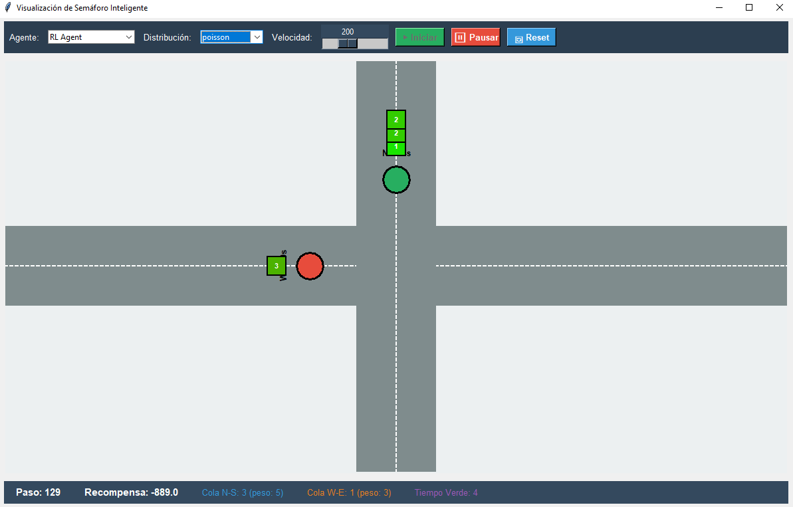

# MDP-and-RL-Examples
This repository implements Markov Decision Processes (MDPs) and reinforcement learning to solve two problems: the first is a traffic intersection problem aimed at minimizing the wait time for cars, and the second is the optimization of a machine in a factory.


# 1. Definición del Problema 

En un entorno industrial, se busca maximizar la producción total de una unidad de manufactura a lo largo de un horizonte de tiempo $T = 1,000,000$ minutos (aprox. 2 años). La máquina sufre degradación progresiva basada en la velocidad de operación y posee un riesgo estocástico de fallo crítico. El objetivo es encontrar la política óptima $\pi^*$ que decida en cada instante qué velocidad utilizar o si es necesario realizar un mantenimiento preventivo.
---
# 2. Formulación Matemática (Enfoque MDP)

Definimos el problema como un Proceso de Decisión de Markov (MDP) dado por la tupla $(S, A, P, R, \gamma)$.

### A. Espacio de Estados ($S$)
El estado representa el nivel de desgaste de la máquina.

$$S = \{0, 1, 2, ..., 9, 10\}$$

* $s=0$: Máquina nueva.
* $s=1..9$: Grados de desgaste creciente.
* $s=10$: Fallo crítico (Estado absorbente temporal).

### B. Espacio de Acciones ($A$)
En cada paso de tiempo (ej. $t = 100$ minutos), el agente decide:

$$A = \{\text{Lento}, \text{Medio}, \text{Rápido}, \text{Reparar}\}$$

> **Nota:** Se añade "Reparar" como acción voluntaria (mantenimiento preventivo).

---


## 1. Probabilidades de aumento de desgaste ($\alpha_a$)

| Acción | Interpretación | $\alpha_a$ |
|--------|----------------|------------|
| Lento  | Prob. de aumentar desgaste si tarda 1000 min | 1/1000 |
| Medio  | Prob. de aumentar desgaste si tarda 800 min  | 1/800  |
| Rápido | Prob. de aumentar desgaste si tarda 600 min  | 1/600  |

---

## 2. Probabilidad de fallo ($\beta_s$)

| Estado $s$ | $\beta_s$ |
|------------|-----------|
| 0 | 0.0 |
| 1 | 0.001 |
| 2 | 0.005 |
| 3 | 0.01 |
| 4 | 0.02 |
| 5 | 0.05 |
| 6 | 0.1 |
| 7 | 0.2 |
| 8 | 0.4 |
| 9 | 0.6 |

---

## 3. Recompensas ($R$)

| Estado | Acción | Recompensa |
|--------|--------|-------------|
| s | Lento | +10 |
| s | Medio | +25 |
| s | Rápido | +50 |
| s | Reparar | 0 |
| s=10 | Cualquier acción | -INF |

---

## 4. Tiempos de reparación (penalización)

| Estado antes de reparar | $T_{rep}(s)$ (min) |
|--------------------------|--------------------|
| 1 | 100 |
| 2 | 300 |
| 3 | 500 |
| 4 | 700 |
| 5 | 1000 |
| 6 | 1500 |
| 7 | 2000 |
| 8 | 2500 |
| 9 | 3000 |
---


### C. Dinámica de Transición ($P$) y Probabilidades

La transición de estado $s_t \to s_{t+1}$ se define así:

* Si $a =$ Operar (Lento/Medio/Rápido):
    * La máquina falla con probabilidad $\beta_s \rightarrow s_{t+1} = 10$.
    * Si no falla, aumenta desgaste con prob. $\alpha_a \rightarrow s_{t+1} = s_t + 1$.
    * Si no falla ni aumenta desgaste, se mantiene $\rightarrow s_{t+1} = s_t$.
* Si $a =$ Reparar:
    * La máquina pasa al estado de "Mantenimiento" (o salta directamente al estado recuperado $s=1$ tras $N$ pasos de tiempo de penalización).

---

# 3. Enfoque de Solución

### Iteración de valores
Asumimos que conocemos perfectamente todas las probabilidades y los tiempos de reparación descritos arriba:
* Utilizaremos el algoritmo de **Value Iteration** o **Policy Iteration**.
* Calcularemos la matriz de transición $P(s'|s,a)$ exacta.
* **Objetivo:** Obtener la política teórica óptima $\pi^*(s)$ que nos diga, por ejemplo: "En estado 4, opera Rápido. En estado 8, opera Lento. En estado 9, Repara inmediatamente".

### Parte 2: Solución con Aprendizaje por Refuerzo
Simulamos un escenario donde no conocemos las probabilidades de fallo. El agente debe aprender interactuando.

* **Ambiente:** Un simulador de la máquina usando las reglas del punto 2.
* **Algoritmos:** Q-Learning : Para aprender la utilidad de las acciones arriesgadas mientras se explora.
* **Exploración:** Epsilon-Greedy decadente (empezar probando todo, terminar explotando la mejor estrategia).

---
# 4. Justificación de los Dos Enfoques

### MDP
En ciertas ocasiones o para ciertas máquinas comerciales va a ser posible saber las probabilidades de fallo exactas con mayor seguridad entonces un enfoque exacto nos dará la mejor respuesta. 

### Aprendizaje por refuerzo:
Para nuevas máquinas o componentes no muy conocidos no se conocen las probabilidades con exactitud sin embargo es posible simularlos, con el fin de obtener las mejores políticas.


---
# 5. Resultados

Política óptima, resultado obtenido al usar la ecuación de Bellman e iteración de valores:


Pólitica lograda por Q-learning usando Epsilon-greedy:


Como se puede observar las dos políticas son similares, a excepción del estado 9, esto se debe a que en este estado lleva muchas iteraciones entender que "Rápido" no es la mejor opción, sino que es "Reparar".

Cabe resaltar que Q-learning se entrenó con 100000 iteraciones, esto ya que se necesita visitar varias veces cada estado para que se tenga un valor cada vez más cercano al real. Adicionalmente, como epsilon disminuye con el tiempo, la exploración disminuye antes de que todos los estados se visiten lo suficiente, lo cuál hace necesario que se usen bastantes iteraciones.

# Traffic-Light-Optimization

### Cómo correr:

Desde la carpeta Semaforo

Para la simulación con interfaz gráfica (requiere instalar tkinter):
```
py -m Visualization.visualization
```

Para ver las estadísticas (requiere matplotlib y numpy):

```
py -m Statistics.agent_comparison 
```

## 1. Definición del problema

Se plantea la implementación simplificada de una intersección que consta de dos semáforos y dos filas de carros representando el tráfico. Cada carro tendrá un nivel de afán (por ejemplo para modelar una ambulancia), que vendrá dado por una distribución de probabilidad y estará asignado un sentido (Norte-Sur o Este-Oeste) con cierta probabilidad, para indicar que puede que haya un sentido con más tráfico, al que se le debería dar más prioridad.

Una posible distribución de afanes para mil carros en la simulación se verían asi:


El objetivo es poder crear una visualización donde se aprecie que el semáforo cambia dependiendo de la cantidad de autos por sentido y el nivel de afán de los carros en el tráfico.

---

## 2. Definición de Algoritmos

### Agente:
Este problema será manejado utilizando Approximate Q-Learning, una técnica de aprendizaje por refuerzo, ya que el espacio de estados es gigante. Esto se debe a que en esta implementación decidimos no manejar un límite de carros por sentido. Como cada carro tiene el atributo de afán, modelar la totalidad de los estados no sería factible ya que si tuviésemos, por ejemplo, en las dos filas 30 carros y se escogen de distribución uniforme los afanes, podría sencillamente haber $10^{30}$ estados.

Es por esto que debemos definir los features que vamos a considerar durante la simulación: 
- `active_lane_cars` La cantidad de carros en la fila con el semáforo en verde
- `inactive_lane_cars` La cantidad de carros en la fila con el semáforo en rojo
- `active_lane_eagerness` La cantidad de afán en la fila con el semáforo en verde
- `inactive_lane_eagerness` La cantidad de afán en la fila con el semáforo en rojo
- `switch` La cantidad de tiempo que se tarda en cambiar los colores de los semáforos
- `patience` Una virtud que se le atribuye si decide no cambiar al tener poco tiempo 

Se utilizará un código muy similar al entregado en los laboratorios previos, para trabajar con métodos de agentes Q-learning como `ComputeActionFromQValues`.

Como estos algoritmos buscan maximizar, pero en este caso necesitamos minimizar la cantidad de carros o de afán, necesitaremos que las rewards sean negativas.

### Entorno:
Para modelar el flujo del tráfico, decidimos que por cada paso de tiempo que se dé, al estar en un espacio discreto, pueda avanzar el carro en la primera posición de la fila, si su correspondiente semáforo se encuentra en verde. Además, con ciertas probabilidades se añade un carro en cada sentido, para que crezca la fila de carros. Esto es útil para ver cómo se comporta la intersección en horas pico (muchos carros llegan a la intersección) vs una hora tranquila (las filas de carros no son muy largas) o para ver un sentido como una vía principal, que haya carros casi en todo momento y que el otro sentido no lo sea.

Un ejemplo de la visualización para poder apreciar el entorno y las decisiones tomadas por el agente se muestra a continuación:



---

## 3.Resultados

Se asumió que la probabilidad de que un carro entre por el sentido NS sea de 0.5 y en el otro de 0.2, por lo que es más transitado este sentido. Se testearon para todas las distribuciones de afanes de los carros entre sí y contra unos agentes naive, que cambiaban los semáforos cada cierto intervalo de tiempo fijo, como 10 pasos. A continuación se muestran las gráficas obtenidas:


De acá podemos ver que las recompensas obtenidas, que es la cantidad que queremos minimizar, es aproximadamente el 90% mejor que contra los agentes naive y que cuando los afanes de los carros están distribuidos uniformemente, se logra un mejor desempeño, aprendiendo mejor los valores de los features. Por ejemplo, como un valor 10 es raro, aprenderá que debe dejar pasar la fila de carros donde se encuentre este.

Por otro lado tenemos el siguiente análisis que nos pareció interesante, la convergencia del aprendizaje, que se ve reflejado en cómo disminuye la longitud promedio de la fila y por las recompensas que va obteniendo conforme va aprendiendo. Consideramos que hiciese 1000 episodios cada uno de 500 pasos de la intersección, por lo que aprende tanto escenarios iniciales como intermedios.


 Vemos como en el paso 400 aproximadamente los agentes ya tienen una política definida, exceptuando el comportamiento anómalo de la distribución normal, probablemente debido a que no se había enfrentado a escenarios donde hubiese muchos carros con mucho afán.

---

 ## 4.Conclusiones

El agente adaptativo de Q-Learning logró una mejora de aproximadamente el 90% en la recompensa total (el valor que se busca minimizar, representando el costo del tráfico) en comparación con los agentes que cambiaban el semáforo con un tiempo fijo

La incorporación del atributo de afán  en los features permitió al agente priorizar dinámicamente las filas más urgentes, optimizando la recompensa incluso con tráfico desequilibrado

La decisión de usar Approximate Q-Learning fue acertada, ya que el espacio de estados era muy grande potencialmente $10^{30}$ estados

